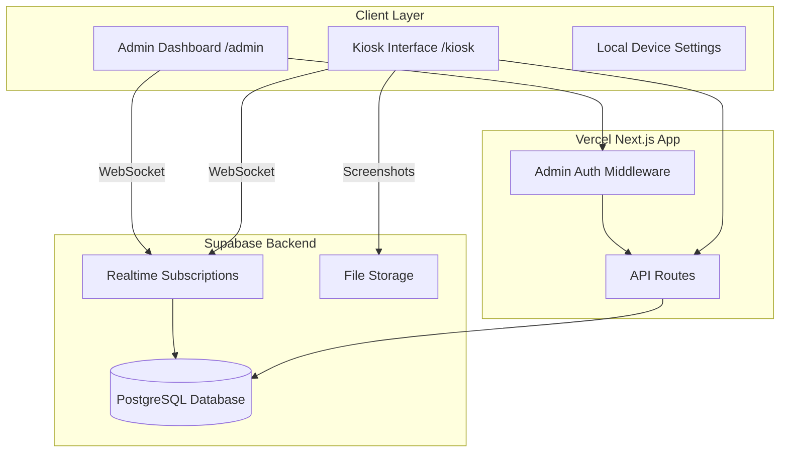

# School Kiosk Management System Implementation Plan

## Architecture Overview



## Tech Stack

- **Frontend:** Next.js 14 (App Router), React, TypeScript, TailwindCSS, Shadcn/ui
- **Backend:** Supabase (PostgreSQL, Realtime, Storage)
- **Hosting:** Vercel (free tier)
- **State Management:** Zustand + Supabase Realtime
- **i18n:** next-intl for bilingual support
- **Monitoring:** Browser APIs for battery, uptime, activity tracking

## Database Schema

### Tables

**devices**

- id (uuid, primary key)
- device_name (text) - user-friendly name set by admin
- device_fingerprint (text, unique) - auto-generated ID
- last_seen (timestamp)
- is_active (boolean)
- battery_level (integer)
- battery_charging (boolean)
- uptime_seconds (bigint)
- created_at (timestamp)
- updated_at (timestamp)

**device_students**

- id (uuid, primary key)
- device_id (uuid, foreign key)
- session_id (uuid, foreign key, nullable)
- student_names (text[]) - array of student names
- joined_at (timestamp)

**sessions**

- id (uuid, primary key)
- name (text)
- session_type_id (uuid, foreign key)
- status (enum: 'pending', 'active', 'paused', 'completed')
- created_by (text) - admin identifier
- started_at (timestamp, nullable)
- ended_at (timestamp, nullable)
- settings (jsonb) - custom settings per session

**session_types**

- id (uuid, primary key)
- name (text) - e.g., "SPIKE", "Canva"
- url_template (text) - e.g., "https://www.canva.com"
- icon_url (text, nullable)
- allow_url_preview (boolean) - if true, teacher can view student work URLs
- iframe_enabled (boolean)
- created_at (timestamp)

**device_activity**

- id (uuid, primary key)
- device_id (uuid, foreign key)
- session_id (uuid, foreign key, nullable)
- screenshot_url (text, nullable)
- student_work_url (text, nullable) - for shareable links
- mouse_activity_count (integer)
- keyboard_activity_count (integer)
- recorded_at (timestamp)

**settings**

- id (uuid, primary key)
- key (text, unique)
- value (jsonb)
- updated_at (timestamp)

### Row Level Security (RLS)

- Public read access for devices, sessions, session_types (kiosks need to read)
- Admin password check for mutations (enforced in API layer)
- Real-time subscriptions open for monitoring

## Project Structure

```
/
├── public/
│   ├── eliade-logo.jpg
│   └── locales/
│       ├── en.json
│       └── ro.json
├── src/
│   ├── app/
│   │   ├── [locale]/
│   │   │   ├── kiosk/
│   │   │   │   ├── page.tsx (main kiosk interface)
│   │   │   │   ├── session/[id]/page.tsx (active session view)
│   │   │   │   └── settings/page.tsx (local device settings)
│   │   │   ├── admin/
│   │   │   │   ├── page.tsx (dashboard)
│   │   │   │   ├── devices/page.tsx (device management)
│   │   │   │   ├── sessions/page.tsx (session control)
│   │   │   │   └── config/page.tsx (session types config)
│   │   │   ├── layout.tsx
│   │   │   └── page.tsx (redirect to /kiosk)
│   │   └── api/
│   │       ├── auth/verify/route.ts
│   │       ├── devices/route.ts
│   │       ├── sessions/route.ts
│   │       └── activity/route.ts
│   ├── components/
│   │   ├── kiosk/
│   │   │   ├── StudentNameInput.tsx
│   │   │   ├── SessionViewer.tsx (iframe wrapper)
│   │   │   ├── DeviceHeader.tsx
│   │   │   └── ActivityTracker.tsx (monitors user activity)
│   │   ├── admin/
│   │   │   ├── DeviceMonitor.tsx (real-time device grid)
│   │   │   ├── SessionControl.tsx (create/manage sessions)
│   │   │   ├── LivePreview.tsx (student screen preview)
│   │   │   ├── SessionTypeManager.tsx
│   │   │   └── StatsDashboard.tsx
│   │   ├── shared/
│   │   │   ├── LanguageToggle.tsx
│   │   │   ├── AdminPasswordDialog.tsx
│   │   │   └── Logo.tsx
│   │   └── ui/ (shadcn components)
│   ├── lib/
│   │   ├── supabase/
│   │   │   ├── client.ts (browser client)
│   │   │   ├── server.ts (server client)
│   │   │   └── types.ts (generated types)
│   │   ├── hooks/
│   │   │   ├── useDevice.ts (device ID & monitoring)
│   │   │   ├── useSession.ts (current session state)
│   │   │   ├── useRealtimeDevices.ts
│   │   │   └── useBatteryStatus.ts
│   │   ├── stores/
│   │   │   ├── deviceStore.ts (Zustand)
│   │   │   └── sessionStore.ts (Zustand)
│   │   └── utils/
│   │       ├── deviceFingerprint.ts
│   │       ├── activityMonitor.ts
│   │       └── screenshotCapture.ts
│   ├── middleware.ts (i18n + admin auth)
│   └── types/
│       └── index.ts
├── .env.local
├── .env.example
├── next.config.js
├── tailwind.config.ts
├── package.json
└── README.md
```

## Implementation Steps

### 1. Project Setup

- Initialize Next.js 14 with TypeScript, TailwindCSS, App Router
- Install dependencies: `@supabase/supabase-js`, `zustand`, `next-intl`, `@radix-ui/*`, `lucide-react`
- Configure Supabase client with environment variables
- Setup TailwindCSS with Mircea Eliade brand colors (gold #F4C542, forest green #2C5F2D)

### 2. Database & Supabase Configuration

- Create Supabase project (free tier)
- Run migration to create all tables with proper relationships
- Configure RLS policies for public read, authenticated writes
- Setup Supabase Storage bucket for screenshots (public read)
- Enable Realtime for `devices`, `device_students`, `sessions`, `device_activity` tables

### 3. Device Management System

- Implement device fingerprinting using canvas fingerprint + localStorage UUID
- Create `useDevice` hook that:
  - Generates/retrieves device ID on first load
  - Registers device in Supabase if new
  - Updates heartbeat every 30 seconds (last_seen, battery, uptime)
- Build local settings page (protected by admin password from env)
  - Allow device name customization
  - Display device ID for admin reference
  - Option to reset device registration

### 4. Kiosk Interface (`/kiosk`)

**Initial Screen (No Active Session)**

- Display school logo and device name at top
- Language toggle (EN/RO) in corner
- "Add Student" section with + button to add multiple student names
- Show list of entered student names with remove option
- Display "Waiting for session..." status
- Show battery indicator and connection status

**Active Session Screen**

- Redirect to `/kiosk/session/[id]` automatically when session starts
- Embed session URL in full-screen iframe
- Minimal header with: device name, session name, battery, time
- Activity tracker running in background (mouse/keyboard events every 5 minutes)
- Screenshot capture every 2 minutes uploaded to Supabase Storage
- Detect if external site provides shareable URL (for Canva, etc.) and send to backend

### 5. Admin Dashboard (`/admin`)

**Authentication**

- Simple password prompt on entry (stored in `ADMIN_PASSWORD` env variable)
- JWT stored in httpOnly cookie (7-day expiry)
- Middleware protection on all `/admin` routes

**Main Dashboard View**

- Hero stats: Total devices, Active sessions, Students online, Avg uptime
- Real-time device grid showing:
  - Device name, ID badge
  - Current status (idle/active)
  - Student names
  - Battery level with icon
  - Uptime
  - Last screenshot thumbnail (click to enlarge)
  - Activity level indicator (based on mouse/keyboard events)
- Live session control panel
- Quick actions: Create session, Configure types, View all devices

**Session Management Page**

- "Create New Session" button opens dialog:
  - Session name input
  - Select session type from dropdown (SPIKE, Canva, etc.)
  - Custom settings (optional)
  - Start immediately or schedule
- Active sessions list with:
  - Session name, type, start time
  - Connected devices count
  - Pause/Resume/End controls
  - "View Devices" expands to show all students in session
- Session history with analytics

**Device Management Page**

- Searchable/filterable device list
- Rename devices
- View device history (sessions participated, uptime stats)
- Remove/reset devices

**Configuration Page**

- Manage session types (CRUD operations):
  - Name, icon, URL template
  - Enable/disable iframe embedding
  - Toggle URL preview capability
- Admin password change
- System settings (screenshot frequency, activity tracking intervals)

### 6. Real-time Features

**Kiosk Side**

- Subscribe to `sessions` table changes
- Auto-redirect when session assigned to device
- Auto-redirect back to home when session ends
- Update local state when session paused/resumed

**Admin Side**

- Subscribe to `devices` and `device_activity` for live updates
- Real-time device status changes (online/offline based on last_seen)
- Live screenshot updates in device cards
- Real-time student name updates when students join

### 7. Activity Monitoring

**Client-side Tracking**

- Battery API for battery level and charging status
- Performance API for uptime calculation
- Mouse move and click event counters (debounced)
- Keyboard event counters (not capturing keys, just activity)
- Tab visibility API to detect when kiosk loses focus

**Screenshot Capture**

- Use `html2canvas` library to capture viewport
- Resize to 400x300 thumbnail
- Upload to Supabase Storage every 2 minutes during active session
- Update `device_activity` table with screenshot URL

**Work URL Detection**

- For Canva: Listen for URL changes, extract share link if present
- For other platforms: Look for shareable URL patterns
- Allow manual URL submission by students (optional feature)

### 8. Internationalization (i18n)

**Implementation**

- Use `next-intl` for translations
- Create translation files: `en.json`, `ro.json`
- Middleware to detect/set locale from path
- Translate all UI strings (kiosk and admin)
- Format dates, times, numbers according to locale
- Language toggle component with flag icons

**Key Translation Areas**

- Kiosk: "Add Student", "Waiting for session", button labels, status messages
- Admin: Dashboard labels, form fields, table headers, notifications
- Error messages and validation feedback

### 9. UI/UX Design

**Design System**

- Primary: Gold (#F4C542) for CTAs and highlights
- Secondary: Forest Green (#2C5F2D) for headers and accents
- Neutral: Gray scale for backgrounds and text
- Use Shadcn/ui components for consistency
- Custom components styled with school brand

**Kiosk Interface**

- Clean, minimal, student-friendly
- Large touch-friendly buttons
- Clear status indicators
- Full-screen session view

**Admin Dashboard**

- Professional enterprise look
- Dense information layout with clear hierarchy
- Data visualizations for stats
- Responsive grid for device monitoring
- Smooth animations and transitions

### 10. Deployment & Configuration

**Environment Variables**

```
												NEXT_PUBLIC_SUPABASE_URL=your_supabase_url
NEXT_PUBLIC_SUPABASE_ANON_KEY=your_anon_key
SUPABASE_SERVICE_ROLE_KEY=your_service_key
ADMIN_PASSWORD=your_secure_password
NEXT_PUBLIC_APP_URL=https://eliade-ed-tehn-kiosk.vercel.app
```

**Vercel Setup**

- Connect GitHub repository
- Configure environment variables
- Enable automatic deployments
- Set up preview deployments for testing

**Post-Deployment**

- Add default session types (SPIKE, Canva, etc.)
- Test device registration flow
- Verify real-time updates working
- Test admin authentication
- Verify iframe embedding works for target platforms

## Key Features Summary

### Kiosk

- Auto device registration with hybrid identification
- Multi-student name entry
- Real-time session synchronization
- Embedded content viewer with iframe
- Activity tracking and screenshot capture
- Battery and connection monitoring
- Bilingual support

### Admin Dashboard

- Real-time device monitoring with live screenshots
- Complete session lifecycle management
- Configurable session types
- Device management and renaming
- Student tracking across sessions
- Activity analytics and uptime stats
- URL preview for collaborative work (Canva, etc.)
- Bilingual interface

### Technical Highlights

- Fully serverless on Vercel free tier
- Supabase for database, real-time, and storage
- No external services required
- Type-safe with TypeScript
- Responsive and accessible UI
- Enterprise